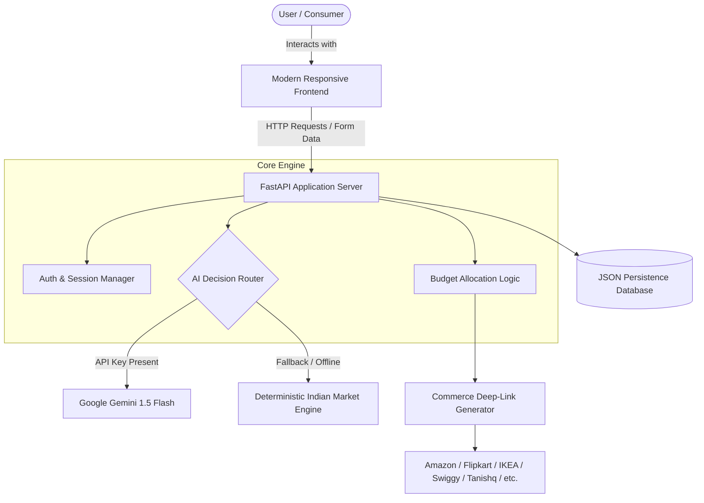

# Proposed Solution

## 1. Solution Architecture Overview
The proposed solution for **PocketSmart AI** unifies responsive web design, asynchronous API services, algorithmic budget modeling, GenAI prompts, and direct vendor deep-linking into a coherent workflow.

---

## 2. Detailed Solution Modules

### 2.1 Authentication & Profile Management
- **Security Paradigm**: OAuth2 Password Flow utilizing JWT (JSON Web Tokens) with HS256 encryption.
- **Session Handling**: Dual-mode session identification using HttpOnly cookies for web browsers and Bearer authorization headers for REST API callers.
- **Password Protection**: Salted bcrypt hashing with 72-byte truncation safety.

### 2.2 Home Interior Planner (`/home-planner`)
- **Inputs**: Total budget (INR), lighting count, ceiling fan count, furniture items count, dining table requirements, room flags (Living Room, Kitchen, Bedroom), and custom notes.
- **Output Engine**:
  - Validates total budget against item minimums.
  - Distributes budget across categories using calibrated ratios.
  - Emits itemized product names, quantities, individual unit costs, and total category allocations.
  - Dynamically synthesizes search URLs for IKEA India, Amazon.in, Flipkart, Myntra, and Ajio.

### 2.3 Party & Event Budget Planner (`/party-planner`)
- **Inputs**: Total budget (INR), attendee count, event type (Birthday, Wedding, Anniversary, Corporate), venue style, requirement checkboxes (Catering, Decoration, Entertainment), and special requirements.
- **Output Engine**:
  - Implements proportional funding: Catering (~40%), Venue (~25%), Decor (~15%), Entertainment (~10%), Contingency Buffer (~10%).
  - Provides capacity-matched venue suggestions.
  - Synthesizes search URLs for Swiggy, Zomato, BigBasket, BookMyShow, OYO, Booking.com, and MakeMyTrip.

### 2.4 Multimodal Jewelry Recommendation Engine (`/jewelry-planner`)
- **Inputs**: Total budget (INR), event occasion, stylistic preferences, and optional outfit image upload.
- **Output Engine**:
  - Accepts image uploads (`multipart/form-data`) and saves them locally.
  - Runs image color extraction (RGB quantizer or Gemini Vision API) to extract dominant palettes and formality levels.
  - Generates cohesive ornament recommendations (necklaces, earrings, rings, bracelets).
  - Synthesizes search URLs for Tanishq, CaratLane, BlueStone, Melorra, and Amazon.

### 2.5 Data Persistence & History
- Uses a structured JSON data store (`data/database.json`) storing user credentials and full historical recommendation trees.
- Allows instant recall, filtering, and inspection via the interactive history modal.
