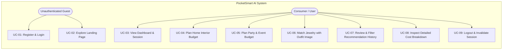

# Use Cases Specification

## Use Case Diagram

---

## Detailed Use Cases

### UC-01: User Registration & Authentication
- **Primary Actor**: Consumer / Guest
- **Preconditions**: User has network access to the server port.
- **Trigger**: User navigates to `/login` or `/register`.
- **Main Success Scenario**:
  1. User enters username, email, and password.
  2. System validates input, hashes password via bcrypt, and saves user to `database.json`.
  3. System creates a signed JWT token and sets an `HttpOnly` session cookie.
  4. System redirects user to `/dashboard`.
- **Alternative Flow**: If credentials are invalid, system renders `/login` with error message `"Invalid username or password"`.

---

### UC-02: Plan Home Interior Budget
- **Primary Actor**: Authenticated User
- **Preconditions**: User is logged in.
- **Trigger**: User navigates to `/home-planner` and fills form.
- **Main Success Scenario**:
  1. User enters total budget (e.g., ₹50,000) and desired fixture counts (4 lights, 2 fans, 1 furniture set).
  2. User selects rooms (Living Room, Kitchen).
  3. User clicks "Generate Home Plan".
  4. Frontend sends asynchronous POST request to `/home-budget`.
  5. Backend allocates budget across lighting (15%), fans (20%), and furniture (35%).
  6. Backend generates search links for IKEA India, Amazon.in, and Flipkart.
  7. Plan is saved to user's history and returned as JSON.
  8. Frontend dynamically renders calculation table and item cards.

---

### UC-03: Plan Party & Event Budget
- **Primary Actor**: Authenticated User
- **Preconditions**: User is logged in.
- **Trigger**: User navigates to `/party-planner`.
- **Main Success Scenario**:
  1. User inputs total budget (e.g., ₹1,00,000), guest count (50), party type ("Wedding Reception"), and venue type ("Banquet Hall").
  2. User toggles catering, decor, and entertainment requirements.
  3. User submits form to `/party-budget`.
  4. System computes proportions: 40% Catering, 25% Venue, 15% Decor, 10% Entertainment, 10% Safety Buffer.
  5. System attaches venue suggestions and links to Swiggy, Zomato, BookMyShow, and MakeMyTrip.
  6. Plan is appended to history and displayed on UI.

---

### UC-04: Match Jewelry with Outfit Image
- **Primary Actor**: Authenticated User
- **Preconditions**: User is logged in.
- **Trigger**: User navigates to `/jewelry-planner`.
- **Main Success Scenario**:
  1. User enters total budget (e.g., ₹20,000) and occasion ("Cocktail Gala").
  2. User uploads an outfit image (`outfit.jpg`).
  3. System saves image to `static/uploads/`.
  4. System analyzes image colors (RGB histogram analyzer or Gemini Vision) detecting dominant colors (e.g., Emerald Green and Gold Accent).
  5. System suggests matching jewelry pieces (necklace, earrings, rings) with estimated prices and styling tips.
  6. Sourcing links to Tanishq, CaratLane, and BlueStone are attached.
  7. Results render with color badges and shopping buttons.

---

### UC-05: Review & Filter History
- **Primary Actor**: Authenticated User
- **Preconditions**: User has at least one previous recommendation.
- **Trigger**: User clicks "History" in navbar.
- **Main Success Scenario**:
  1. System queries user's entries in `database.json`.
  2. Page displays cards for each past plan with timestamp, budget, and item counts.
  3. User clicks category filter tabs ("Home", "Party", "Jewelry") to view relevant plans.

---

### UC-06: Inspect Detailed Breakdown Modal
- **Primary Actor**: Authenticated User
- **Trigger**: User clicks "View Details" on any history item.
- **Main Success Scenario**:
  1. Frontend fetches `/recommendation-details/{id}`.
  2. System returns the full nested JSON structure.
  3. Frontend renders an interactive modal displaying itemized costs, contingency margins, and platform search links.

---

### UC-07: Logout & Invalidate Session
- **Primary Actor**: Authenticated User
- **Trigger**: User clicks "Logout" button.
- **Main Success Scenario**:
  1. Request sent to `/logout`.
  2. Active token added to in-memory blacklist.
  3. Active session deleted from memory.
  4. `access_token` cookie cleared.
  5. User redirected to `/login`.
