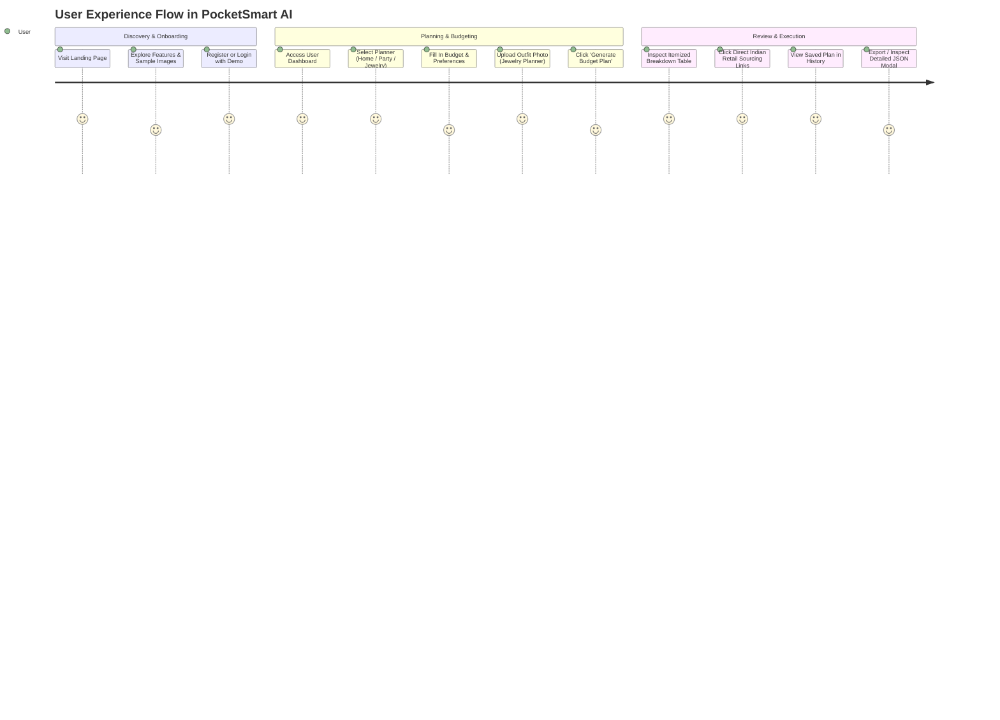

# User Requirements Specification

## 1. Target User Personas

### Persona 1: Amit Sharma — The New Homeowner
- **Demographics**: 29 years old, Software Engineer, Bengaluru, Karnataka.
- **Context**: Just purchased a 2BHK flat. Has a remaining furnishing budget of ₹1,50,000.
- **Pain Point**: Overwhelmed by furniture showroom prices and unsure how much to keep aside for basic ceiling fans and LED fixtures.
- **Needs**: An automated budget breakdown that guarantees essential electricals are accounted for before spending money on decorative sofas. Direct links to order quickly from IKEA and Amazon India.

### Persona 2: Priya Patel — The Wedding / Event Host
- **Demographics**: 26 years old, Marketing Executive, Ahmedabad, Gujarat.
- **Context**: Organizing a 40-guest Sangeet & cocktail dinner with a budget of ₹75,000.
- **Pain Point**: Afraid venue hire will consume 80% of the funds, leaving guests with substandard food or no music.
- **Needs**: Clear proportional guidance showing safe spending caps for catering, venue, decorations, and DJ entertainment, along with links to Swiggy/Zomato catering and BookMyShow artists.

### Persona 3: Ananya Sen — The Occasion Jewelry Shopper
- **Demographics**: 24 years old, Graduate Student, Kolkata, West Bengal.
- **Context**: Attending a cousin's formal wedding reception in a deep royal blue and gold silk saree. Budget: ₹12,000.
- **Pain Point**: Needs jewelry that matches the saree's color and neckline style without exceeding her budget.
- **Needs**: Upload a photo of the outfit, let AI identify matching tones and recommend jewelry pieces with instant links to CaratLane and Tanishq.

---

## 2. User Journey Mapping

---

## 3. High-Level User Expectations
1. **Zero Financial Guesswork**: Users expect realistic INR estimates tailored to Indian commerce tiers (budget, mid-tier, premium).
2. **Speed & Clarity**: Budget results must appear instantly with clear percentage graphics.
3. **One-Click Shopping**: Links should open directly with search queries filled in so users can buy immediately.
4. **Data Privacy**: Personal plans and credentials must be secure and private to the user's account.
