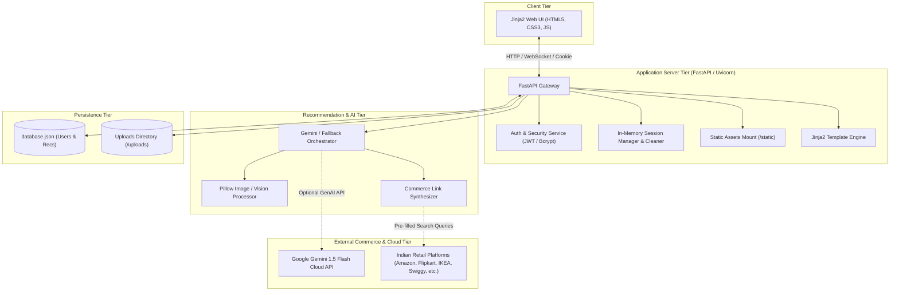
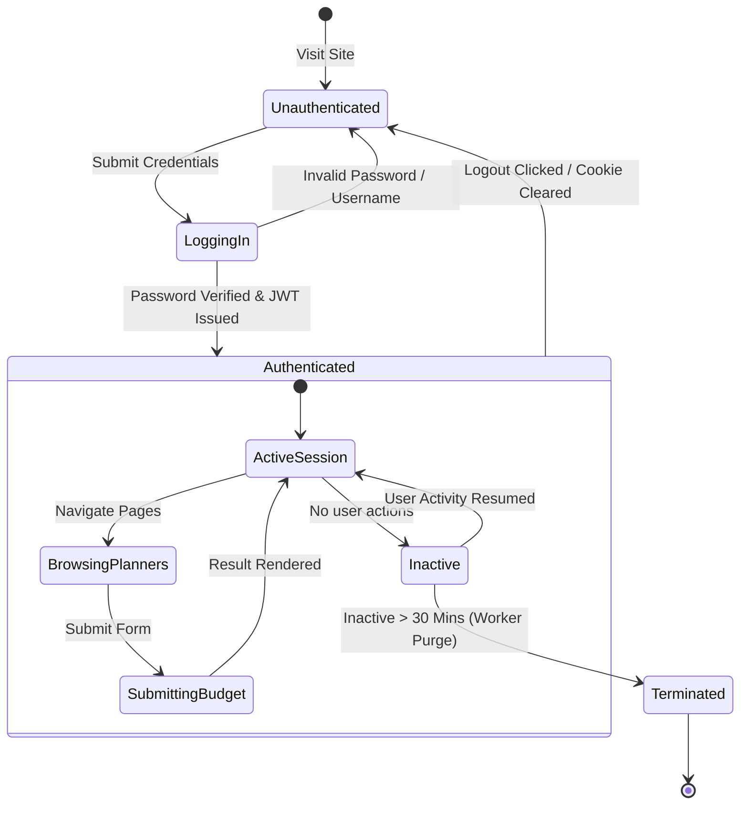

# Architecture Diagrams & Visualizations

This directory contains architectural blueprints and topology diagrams for **PocketSmart AI**.

---

## 1. System Component Architecture

---

## 2. Authentication State Machine

