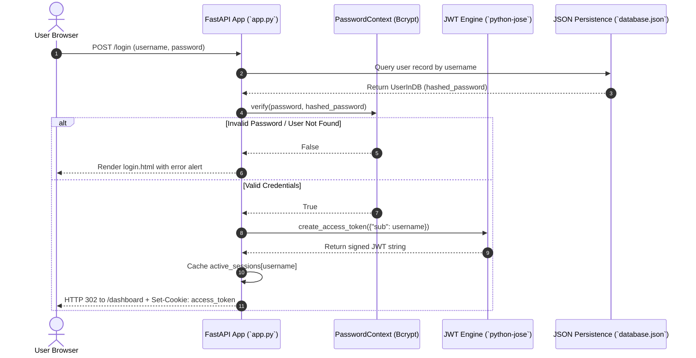
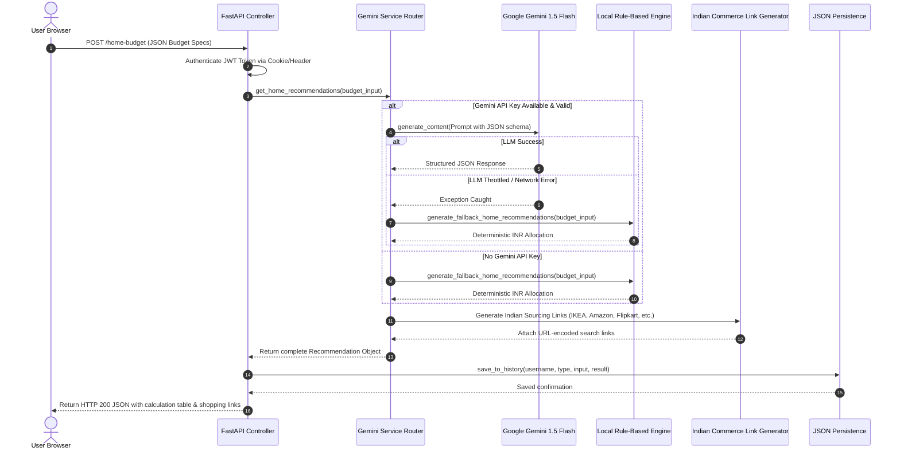
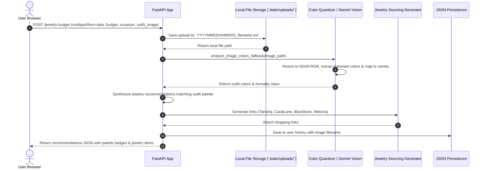

# Data Flow Specification

## 1. Authentication & Session Data Flow

```mermaid
sequenceDiagram
    autonumber
    actor User as User Browser
    participant App as FastAPI App (`app.py`)
    participant Pwd as PasswordContext (Bcrypt)
    participant JWT as JWT Engine (`python-jose`)
    participant DB as JSON Persistence (`database.json`)

    User->>App: POST /login (username, password)
    App->>DB: Query user record by username
    DB-->>App: Return UserInDB (hashed_password)
    App->>Pwd: verify(password, hashed_password)
    alt Invalid Password / User Not Found
        Pwd-->>App: False
        App-->>User: Render login.html with error alert
    else Valid Credentials
        Pwd-->>App: True
        App->>JWT: create_access_token({"sub": username})
        JWT-->>App: Return signed JWT string
        App->>App: Cache active_sessions[username]
        App-->>User: HTTP 302 to /dashboard + Set-Cookie: access_token
    end
```

---

## 2. Budget Recommendation & E-Commerce Flow

```mermaid
sequenceDiagram
    autonumber
    actor User as User Browser
    participant App as FastAPI Controller
    participant Service as Gemini Service Router
    participant LLM as Google Gemini 1.5 Flash
    participant Fallback as Local Rule-Based Engine
    participant LinkGen as Indian Commerce Link Generator
    participant DB as JSON Persistence

    User->>App: POST /home-budget (JSON Budget Specs)
    App->>App: Authenticate JWT Token via Cookie/Header
    App->>Service: get_home_recommendations(budget_input)
    
    alt Gemini API Key Available & Valid
        Service->>LLM: generate_content(Prompt with JSON schema)
        alt LLM Success
            LLM-->>Service: Structured JSON Response
        else LLM Throttled / Network Error
            LLM-->>Service: Exception Caught
            Service->>Fallback: generate_fallback_home_recommendations(budget_input)
            Fallback-->>Service: Deterministic INR Allocation
        end
    else No Gemini API Key
        Service->>Fallback: generate_fallback_home_recommendations(budget_input)
        Fallback-->>Service: Deterministic INR Allocation
    end

    Service->>LinkGen: Generate Indian Sourcing Links (IKEA, Amazon, Flipkart, etc.)
    LinkGen-->>Service: Attach URL-encoded search links
    Service-->>App: Return complete Recommendation Object
    App->>DB: save_to_history(username, type, input, result)
    DB-->>App: Saved confirmation
    App-->>User: Return HTTP 200 JSON with calculation table & shopping links
```

---

## 3. Multimodal Image Analysis Flow (Jewelry Planner)

```mermaid
sequenceDiagram
    autonumber
    actor User as User Browser
    participant App as FastAPI App
    participant Disk as Local File Storage (`static/uploads/`)
    participant Vision as Color Quantizer / Gemini Vision
    participant Sourcing as Jewelry Sourcing Generator
    participant DB as JSON Persistence

    User->>App: POST /jewelry-budget (multipart/form-data: budget, occasion, outfit_image)
    App->>Disk: Save upload as `YYYYMMDDHHMMSS_filename.ext`
    Disk-->>App: Return local file path
    
    App->>Vision: analyze_image_colors_fallback(image_path)
    Vision->>Vision: Resize to 50x50 RGB, extract dominant colors & map to names
    Vision-->>App: Return outfit colors & formality class
    
    App->>App: Synthesize jewelry recommendations matching outfit palette
    App->>Sourcing: Generate links (Tanishq, CaratLane, BlueStone, Melorra)
    Sourcing-->>App: Attach shopping links
    App->>DB: Save to user history with image filename
    App-->>User: Return recommendations JSON with palette badges & jewelry items
```
