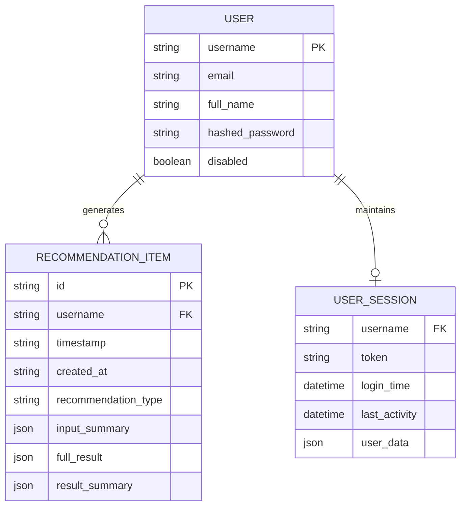

# Database Design & Data Model Specification

## 1. Data Storage Architecture
PocketSmart AI utilizes a structured JSON-backed file storage mechanism (`database.json`), loaded into high-speed in-memory Python dictionaries on application startup and serialized to disk upon data modification. This architecture delivers sub-millisecond query performance, complete schema transparency, and zero external database management overhead.



---

## 2. Schema Definitions

### 2.1 User Entity (`UserInDB`)
Stores authenticated user credentials and profile metadata.

| Field Name | Data Type | Constraint | Description |
|---|---|---|---|
| `username` | `String` | Primary Key, Unique, Lowercase | Unique identifier for login |
| `email` | `String` | Valid Email Format | User's registered email address |
| `full_name` | `String` | Optional, Nullable | Display name formatted on registration |
| `hashed_password` | `String` | Bcrypt Hash String | Salted bcrypt hash (`$2b$12$...`) |
| `disabled` | `Boolean` | Default: `false` | Account active status flag |

### 2.2 Recommendation Item Entity (`RecommendationItem`)
Stores individual budget calculations and generated recommendations.

| Field Name | Data Type | Constraint | Description |
|---|---|---|---|
| `id` | `String` | Primary Key, 8-char UUID | Unique recommendation tracking ID |
| `username` | `String` | Foreign Key (`User.username`) | Owner of the recommendation |
| `timestamp` | `String` | Human-Readable Date | e.g., `"Sep 26, 2026, 01:24 PM"` |
| `created_at` | `String` | ISO 8601 UTC String | e.g., `"2026-09-26T13:24:35.682396+00:00"` |
| `recommendation_type` | `String` | Enum: `home`, `party`, `jewelry` | Type of budget plan |
| `input_summary` | `JSON Object` | Required | Snapshot of user form parameters |
| `full_result` | `JSON Object` | Required | Full budget breakdown, items, links, tips |
| `result_summary` | `JSON Object` | Required | Pre-calculated totals, remaining funds, item count |

### 2.3 User Session Entity (`UserSession`)
Manages transient active session states in memory with automated garbage collection.

| Field Name | Data Type | Description |
|---|---|---|
| `username` | `String` | Username linked to session |
| `token` | `String` | Active JWT token string |
| `login_time` | `DateTime (UTC)` | Timestamp when session initiated |
| `last_activity` | `DateTime (UTC)` | Timestamp of most recent user interaction |
| `user_data` | `Dictionary` | In-memory key-value cache of recent inputs |

---

## 3. Physical Storage Format (`database.json`)

```json
{
  "users": {
    "sai": {
      "username": "sai",
      "email": "sai@pocketsmart.ai",
      "full_name": "Sai Kumar",
      "hashed_password": "$2b$12$pDjjxju1gUYgursSnWG4eugpy42tZpdS.FgQtB7t43EQ5Tr68hzFC",
      "disabled": false
    }
  },
  "recommendations": {
    "sai": [
      {
        "id": "d4a5ac51",
        "username": "sai",
        "timestamp": "Sep 26, 2026, 01:24 PM",
        "created_at": "2026-09-26T13:24:35.682396+00:00",
        "recommendation_type": "home",
        "input_summary": {
          "total_budget": 5000.0,
          "num_lights": 5,
          "num_fans": 4,
          "num_furniture": 2,
          "num_dining_tables": 1,
          "has_living_room": true,
          "has_kitchen": true,
          "has_bedroom": true,
          "additional_requirements": "None"
        },
        "full_result": {
          "total_budget": 5000.0,
          "budget_breakdown": [ ... ],
          "calculation_table_inr": [ ... ],
          "remaining_budget": 0.0
        },
        "result_summary": {
          "total_budget": 5000.0,
          "remaining_budget": 0.0,
          "categories_count": 4
        }
      }
    ]
  }
}
```
