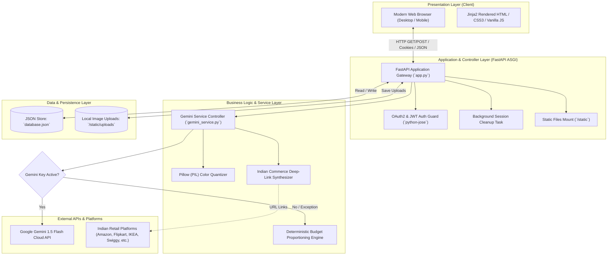

# System Architecture

## 1. High-Level Architecture Overview
PocketSmart AI is engineered as an asynchronous, layered web application built on **FastAPI** and **Uvicorn**, supporting server-rendered Jinja2 HTML templates alongside RESTful JSON endpoints.



---

## 2. Layered Component Responsibilities

### 2.1 Presentation Layer (`frontend/`)
- **Templates (`templates/`)**: Jinja2 templates providing semantic HTML5 layouts:
  - `index.html`: Marketing showcase, feature highlights, sample image displays.
  - `login.html` & `register.html`: Clean authentication forms with validation messages.
  - `dashboard.html`: Quick-access planner tiles and recent activity summaries.
  - `home_planner.html`: Interactive home budget calculator with category sliders/inputs.
  - `party_planner.html`: Event budget planner with guest counters and venue options.
  - `jewelry_planner.html`: Occasion jewelry matcher with drag-and-drop outfit photo upload.
  - `history.html`: Full audit trail of saved recommendations with category filters and details modal.
- **Static Assets (`static/`)**:
  - `styles.css`: Bespoke modern CSS styling with dark-mode color tokens, flex/grid layouts, and animations.
  - `images/`: High-resolution lifestyle imagery for home, party, and jewelry themes.
  - `uploads/`: Secure server storage for user-uploaded outfit photographs.

### 2.2 Controller & API Gateway Layer (`backend/app.py`)
- Mounts static directories and templates.
- Enforces OAuth2 Password flow and JWT token validation.
- Orchestrates route handlers for HTML pages and JSON API endpoints.
- Runs asynchronous session garbage collection via `@app.on_event("startup")`.

### 2.3 Business Logic & Service Layer (`backend/services/gemini_service.py`)
- **Prompt Engineering**: Constructs strict JSON-formatted prompt instructions for Gemini 1.5 Flash.
- **Regex JSON Extractor**: Robust parser (`extract_json_from_response`) extracting clean JSON from markdown code fences (````json ... ````) or nested curly braces.
- **Offline Rule Engine**: Calibrated mathematical algorithms dividing budgets across categories with realistic Indian market item costs.
- **Computer Vision Analyzer**: Color frequency histogram analyzer running locally using Pillow to determine dominant colors and outfit formality.
- **URL Link Synthesizer**: Produces URL-encoded deep search links for 15+ Indian commercial platforms.

### 2.4 Data Persistence Layer (`backend/data/database.json`)
- Atomic reads on startup and write-through operations on each new registration or budget generation.
- Decoupled from heavy database daemon requirements, ensuring zero-dependency deployment.
