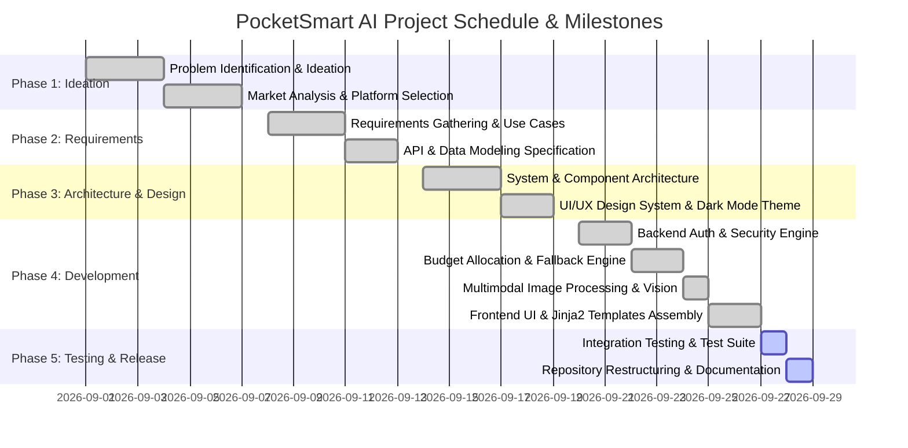

# Project Timeline & Milestones

## 1. Project Schedule Overview

---

## 2. Key Milestones & Deliverables

| Milestone | Target Date | Deliverable Description | Status |
|---|---|---|---|
| **M1: Foundation** | 2026-09-13 | Requirements and architectural blueprints approved | Complete |
| **M2: Core Engine** | 2026-09-22 | FastAPI backend with OAuth2/JWT auth & session manager | Complete |
| **M3: AI & Sourcing** | 2026-09-25 | Dual-engine Gemini/fallback & Indian retailer link generator | Complete |
| **M4: Full Web App** | 2026-09-27 | Responsive Jinja2 Dark Mode interface for all 3 planners | Complete |
| **M5: Testing & Restructure** | 2026-09-28 | 100% test pass rate & 8-phase GitHub repository structure | Complete |
